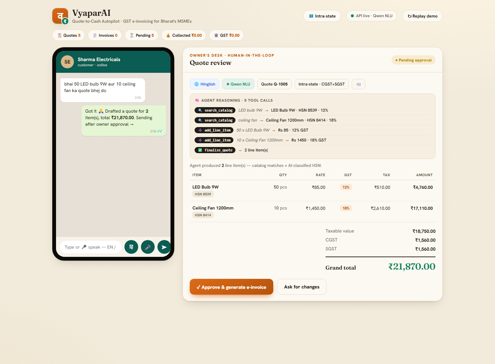
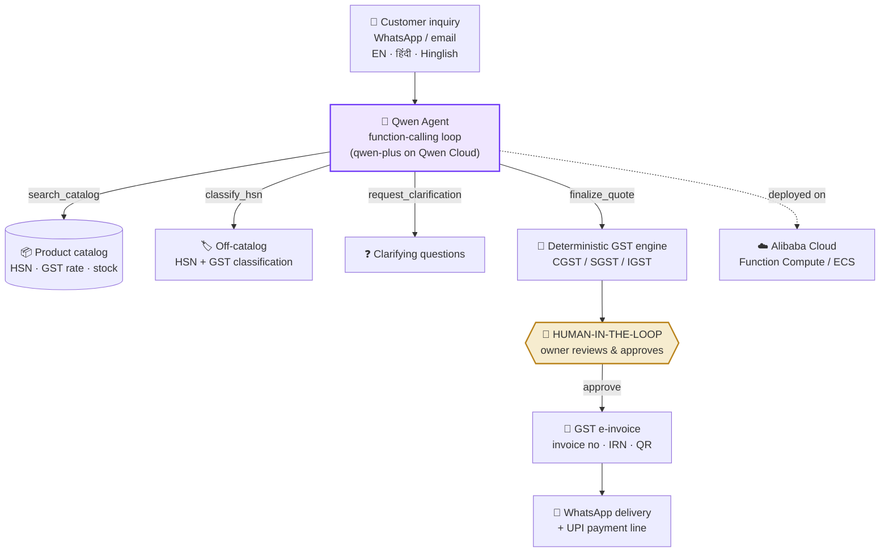

<div align="center">

# व VyaparAI

### The autonomous quote-to-cash agent for Bharat's 60 million MSMEs

**WhatsApp inquiry in → GST e-invoice out. In English, हिंदी, or Hinglish. With the owner in the loop.**

[](LICENSE)
[](requirements.txt)
[](backend/app.py)
[](https://www.qwencloud.com)
[](DEPLOY.md)
[](https://qwencloud-hackathon.devpost.com/)

### ⚡ [Try it live → `47.84.111.3:8000`](http://47.84.111.3:8000)
*Running on Alibaba Cloud ECS (Singapore) · reasoning by `qwen-plus` on Qwen Cloud*

<br>



*A real session: a Hinglish WhatsApp message, the Qwen agent's live tool-calling trace, and a GST-correct quote awaiting the owner's approval.*

</div>

---

## The problem

India runs on **60M+ MSMEs**, and MSMEs run on **WhatsApp**. A typical order looks like:

> *"bhai 50 LED bulb 9W aur 10 ceiling fan ka quote bhej do"*

Behind that one message is a back office the owner doesn't have: parse the mixed Hindi-English, find each product, look up the right **HSN code**, apply the correct **GST rate**, split **CGST/SGST** (or **IGST** inter-state), total it to the rupee, raise a compliant invoice, send it, chase payment. Fifty times a day. By hand.

**VyaparAI is that back office** — an autonomous Qwen agent that runs the entire quote-to-cash workflow and never sends a thing without the owner's approval.

## How it works

```
📱 Customer message (EN / हिंदी / Hinglish)
        │
        ▼
🧠 Qwen function-calling agent ──── search_catalog · classify_hsn · add_line_item
        │                            request_clarification · finalize_quote
        ▼
🧾 GST-correct quote (HSN · CGST/SGST/IGST)
        │
        ▼
👤 HUMAN-IN-THE-LOOP — owner reviews & approves      ← nothing ships without this
        │
        ▼
✅ GST e-invoice (invoice no · IRN · QR) ──▶ 📲 back to WhatsApp, with a UPI pay line
```

## 🧠 A real agent, not a prompt

The core is a genuine **Qwen tool-calling loop** ([`backend/agent/agent_loop.py`](backend/agent/agent_loop.py)): the model decides which of five tools to call, in what order, until the job is done — and the UI shows every step.

Here's an actual trace. We asked for two catalog items **plus a solar panel we don't stock**:

```text
🔍 search_catalog   "LED bulb 9W"       →  LED Bulb 9W · HSN 8539 · 12%
🔍 search_catalog   "ceiling fan"       →  Ceiling Fan 1200mm · HSN 8414 · 18%
🔍 search_catalog   "solar panel 100W"  →  (bad fuzzy match: insulation tape)
➕ add_line_item    20 × LED Bulb 9W    →  ₹85 · 12% GST
➕ add_line_item    5 × Ceiling Fan     →  ₹1,450 · 18% GST
🏷️ classify_hsn     "solar panel 100W"  →  HSN 8541 · 5%        ← the agent caught the
➕ add_line_item    3 × solar PV panel                              bad match and classified
✅ finalize_quote   → 3 line items                                  it itself. Not hardcoded.
```

The agent noticed the catalog's fuzzy match was wrong, **reached for its HSN-classification tool on its own**, and landed on **HSN 8541 @ 5% GST — the correct Indian GST treatment for solar panels**. LLM judgment where it's strong; deterministic code where money is involved:

| Layer | Who does it | Why |
|---|---|---|
| Language detection, parsing, HSN classification, tool choice | **Qwen (`qwen-plus`)** | Judgment, multilingual understanding, domain knowledge |
| Taxable value, CGST/SGST/IGST split, rounding, totals | **Deterministic GST engine** | Money math must be exact, every time |
| Approve & send | **The human owner** | An autopilot you can trust has a checkpoint |

## ✨ Features

|  |  |
|---|---|
| 🗣️ **Bilingual by default** | English, Devanagari Hindi, and code-mixed Hinglish — detected and labeled per quote |
| 🛠️ **Five-tool agent loop** | `search_catalog` · `classify_hsn` · `add_line_item` · `request_clarification` · `finalize_quote` |
| 🏷️ **Off-catalog HSN classification** | Items you don't stock get a correct HSN + GST rate from the model |
| 🧮 **GST-correct math** | Per-item HSN, 12%/18%/5% rates, intra-state CGST+SGST or inter-state IGST |
| ❓ **Clarifying questions** | Ambiguity (specs, brand, delivery) becomes non-blocking questions, not guesses |
| 👤 **Human-in-the-loop** | The owner approves every quote before the e-invoice exists |
| 🧾 **Standards-real e-invoicing** | NIC **INV-01 v1.1** payload, **IRN** per the NIC SHA-256 algorithm, **JWS-signed scannable QR**, printable tax invoice with amount-in-words |
| 🪂 **Graceful degradation** | Model or key down? A heuristic parser keeps quotes flowing |
| 👀 **Transparent reasoning** | The full tool-call trace renders in the review UI |

## 🧾 The output is a real document

Approval doesn't produce a toast message — it produces a **GST tax invoice**: NIC INV-01 v1.1 payload (downloadable at `/invoice/{no}/inv01.json`), an IRN computed with the exact NIC SHA-256 algorithm, a **scannable QR carrying a JWS-signed payload** (self-signed sandbox key; the live IRP's RS256 signature drops into the same seam), and a printable page at `/invoice/{no}`:

<div align="center">

</div>

## 🏗️ Architecture



## 🚀 Quickstart

```bash
git clone https://github.com/SaudSatopay/vyaparai.git && cd vyaparai
python -m venv .venv
# Windows: .venv\Scripts\activate      macOS/Linux: source .venv/bin/activate
pip install -r requirements.txt
cp .env.example .env                   # add your QWEN_API_KEY
uvicorn backend.app:app --reload       # open http://localhost:8000
```

> No key yet? It still runs — the heuristic fallback parses basic inquiries so the full flow stays demoable.

Try the agent from the terminal:

```bash
curl -X POST localhost:8000/inquiry -H "content-type: application/json" \
  -d '{"text":"bhai 50 led bulb 9w aur 10 ceiling fan ka quote bhej do"}'
```

### API

| Endpoint | What it does |
|---|---|
| `POST /inquiry` | Free-text inquiry → agent runs → draft GST quote (pending approval) |
| `POST /approve/{quote_id}` | 👤 Human checkpoint → generates the GST e-invoice |
| `POST /send/{invoice_no}` | Delivers the invoice (WhatsApp channel) |
| `GET /health` | Liveness + whether live Qwen NLU is active |
| `GET /` | The WhatsApp-style human-in-the-loop review UI |

## ☁️ Deployed on Alibaba Cloud

**Live now at [47.84.111.3:8000](http://47.84.111.3:8000)** — ECS `ecs.e-c1m1.large` (Singapore), Ubuntu 22.04, running as a systemd service ([proof screenshot](docs/live-deployment.png)). Reasoning runs on **Qwen Cloud** (`qwen-plus`, OpenAI-compatible endpoint). To reproduce, **[DEPLOY.md](DEPLOY.md)** has both step-by-step paths:

- **Function Compute** (serverless, container image, scales to zero), or
- **ECS** (one small VM + the provided [`systemd` unit](deploy/vyapar.service))

## 📁 Project structure

```
├── backend/
│   ├── app.py                 # FastAPI surface (inquiry → approve → send)
│   ├── models.py              # Quote / Invoice / LineItem (GST fields, agent trace)
│   ├── data/catalog.json      # HSN-tagged demo catalog
│   └── agent/
│       ├── agent_loop.py      # ⭐ the Qwen function-calling agent (5 tools)
│       ├── orchestrator.py    # quote-to-cash flow + human checkpoint + fallback
│       ├── qwen_client.py     # Qwen Cloud client · HSN classifier · heuristic fallback
│       └── tools.py           # catalog search · GST engine · e-invoice · delivery
├── frontend/index.html        # WhatsApp-style review UI (zero-build, single file)
├── docs/                      # demo script · blog post · screenshot
├── Dockerfile · deploy/       # Alibaba Cloud deployment kit
└── DEPLOY.md · SUBMISSION.md
```

## 🗺️ Roadmap

- [x] Qwen tool-calling agent with off-catalog HSN classification + reasoning trace
- [x] GST engine (CGST/SGST/IGST) · bilingual UI · human-in-the-loop · e-invoice + delivery
- [x] E-invoice layer: NIC INV-01 v1.1 · IRN (NIC SHA-256) · JWS-signed scannable QR · printable invoice
- [x] Alibaba Cloud deploy kit
- [ ] Live IRP registration (GSTIN-gated credentials) — drop-in seam ready in `einvoice.register_invoice()`
- [ ] WhatsApp Cloud API as a production channel
- [ ] UPI deep-link payments · ledger/ERP sync
- [ ] Two-way clarification loop with the customer

## ⚖️ Note

Built for the **[Global AI Hackathon Series with Qwen Cloud](https://qwencloud-hackathon.devpost.com/)** — **Autopilot Agent** track. Catalog prices, GST rates, and HSN codes in the demo data are illustrative, not tax advice. The seller GSTIN shown is a sample.

## 📄 License

[MIT](LICENSE) — build on it.

<div align="center">
<br>

**VyaparAI** — *a back office for Bharat's 60 million MSMEs, in any language they type.*

</div>
