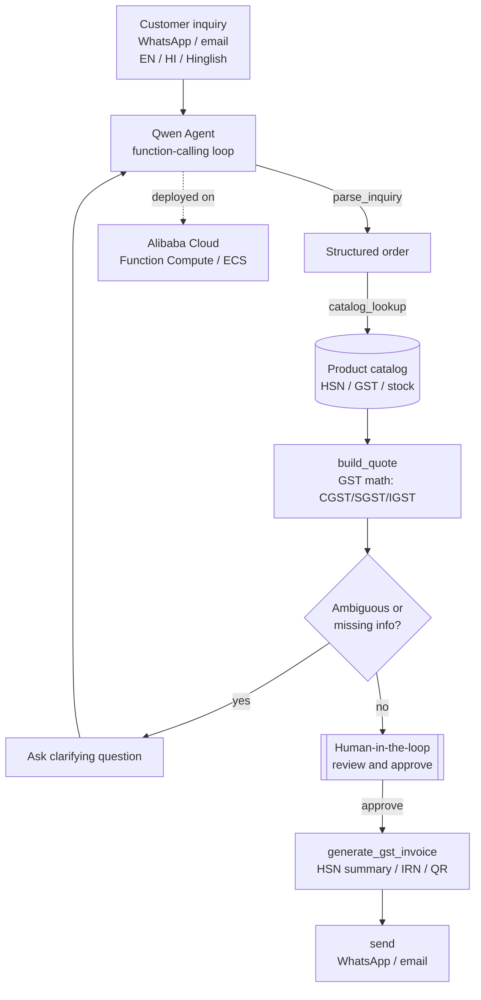

# VyaparAI — Quote-to-Cash Autopilot for Indian MSMEs

> Submission for the **Global AI Hackathon Series with Qwen Cloud** — Track 4: **Autopilot Agent**.
> A bilingual (English / Hindi / Hinglish) agent that turns a raw customer inquiry into an
> **approved, GST-compliant quote & e-invoice** — with a human checkpoint before anything is sent.

## The problem
India has 60M+ MSMEs. Most take orders over **WhatsApp** in mixed English/Hindi, then manually
look up prices, classify **HSN codes**, compute **GST (CGST/SGST/IGST)**, and raise a compliant
invoice. It's slow and error-prone. VyaparAI automates the whole **quote-to-cash** path.

## What it does
1. **Understands** a free-text inquiry in English, Hindi, or Hinglish (Qwen).
2. **Matches** items to the product catalog (HSN code, GST rate, stock).
3. **Builds a quote** with correct GST math (intra-state CGST+SGST or inter-state IGST).
4. **Asks clarifying questions** when the inquiry is ambiguous or items are missing.
5. **Human-in-the-loop:** the owner reviews & approves before anything goes out.
6. **Generates a GST e-invoice** (HSN summary, IRN + signed QR via IRP sandbox) and **sends** it.

## Architecture

Reasoning runs on **Qwen models on Qwen Cloud**; the service is deployed on **Alibaba Cloud**.

## Why it wins (judging criteria)
- **Technical depth (30%):** Qwen tool-calling, multilingual extraction, GST/HSN logic, e-invoice IRN/QR.
- **Innovation (30%):** Hindi/Hinglish + compliance-aware autopilot — an angle few entrants will have.
- **Impact (25%):** real pain for tens of millions of Indian MSMEs; clear path to a product.
- **Presentation (15%):** clean demo + a write-up that also targets the separate Blog Award.

## Tech stack
Python · FastAPI · Pydantic · Qwen Cloud (OpenAI-compatible) · Alibaba Cloud.

## Quickstart
```bash
python -m venv .venv
# Windows: .venv\Scripts\activate     |  macOS/Linux: source .venv/bin/activate
pip install -r requirements.txt
copy .env.example .env                # add QWEN_API_KEY (runs in a naive offline mode without it)
uvicorn backend.app:app --reload
```
Try it:
```bash
# 1) inquiry -> draft quote (pending approval)
curl -X POST localhost:8000/inquiry -H "content-type: application/json" \
  -d "{\"text\":\"bhai 50 led bulb 9w aur 10 ceiling fan ka quote bhej do\"}"

# 2) human approves -> GST e-invoice
curl -X POST localhost:8000/approve/Q-1001
```

## Roadmap
- [x] Agent pipeline: parse → match → quote → approve → invoice → send
- [x] GST math (CGST/SGST/IGST), HSN-tagged catalog
- [ ] Wire Qwen Cloud key + confirm model id / base_url
- [ ] IRP sandbox for a real IRN + signed QR
- [ ] WhatsApp Cloud API channel + web review UI
- [ ] Deploy on Alibaba Cloud + capture deployment proof

## Note
GST rates / HSN codes in `backend/data/catalog.json` are **illustrative samples** for the demo,
not tax advice. Confirm current rates before any production use.

## License
MIT — see [LICENSE](LICENSE).
